<p align="center">
  
</p>

<p align="center">
  <a href="https://linkedin.com/in/amanzadi"></a>
  <a href="https://scholar.google.com"></a>
  <a href="https://twitter.com/amanzadi"></a>
  <a href="mailto:amirhossein.amanzadi@medisin.uio.no"></a>
  
</p>

---

```bash
$ man amir
```

> **Medical AI researcher & builder.** I work at the seam between clinical science, graph learning, and generative AI — translating real biomedical problems into deployable systems. PhD at the University of Oslo (Andreassen Lab, NORMENT), with prior research at Karolinska, Uppsala, and KI, and a track record of shipping AI tools that reach patients and partners.

---

```bash
$ ls ~/research/
```

| Domain | Direction |
|---|---|
| **Graph Neural Networks** | Drug combinations · PPI · multi-omics integration |
| **Clinical AI** | Multimodal models for prognosis, imaging, and decision support |
| **LLMs & VLMs** | Clinical RAG · radiology assistants · agentic biomedical pipelines |
| **Drug Discovery** | PROTACs, molecular glues, generative chemistry, ADMET |
| **Translational ML** | Bench → bedside → production deployment |

---

```bash
$ cat stack.yaml
```

**ml / graphs**


**genai / llms**


**cheminformatics**


**languages**


**infra / mlops**


---

```bash
$ git log --oneline impact/
```

```
a7f3d21  DECISION EU       3 cirrhosis treatments advanced to Phase II trials
b2e8c14  Xanthos           Patented PROTAC hits vs. α-synuclein (Parkinson's)
c5a1f09  Yara              VLM radiology assistant deployed in production
d8b4e72  Medhoush          Clinical chat AI, 40k+ active users across platforms
e1f6a85  Hailo             LLM + robotic wet-lab drug discovery platform
f3c9b41  Clicktromics      Generative AI for antibody-drug conjugate design
```

---

```bash
$ cat publications.bib | head
```

- **Protein–Protein Interaction Prediction for Targeted Protein Degradation**
  Orasch, Weber, Müller, *Amanzadi* et al. — *Int. J. Molecular Sciences* (2022)
- **Predicting Safe Drug Combinations with Graph Neural Networks** *(MSc Thesis)*
  *Amanzadi* — Uppsala University (2021)
- **Designing a Multifunctional Peptide for Metal Chelation & Aβ Inhibition**
  Shamloo, Asadbegi, Khandan, *Amanzadi* — *Polymer Engineering & Science* (2020)

---

```bash
$ history | grep "academic-path"
```

```
2026  PhD Medicine & Health Sciences      University of Oslo
2025  Full Research Scholarship            Mila — Quebec AI Institute
2021  MSc Pharmaceutical Science (1st)     Uppsala University
2018  BSc Pure Chemistry + ME minor        Sharif University of Technology
```

---

```bash
$ echo $STATUS
```

> Open to collaborations in **medical AI**, **graph learning for biomedicine**, and **clinical LLM applications**. Always happy to discuss research, review interesting papers, or sketch ideas at the intersection of medicine and machine learning.

<p align="center">
  <code>$ exit</code>
</p>
  
<!-- Proudly created with GPRM ( https://gprm.itsvg.in ) -->
